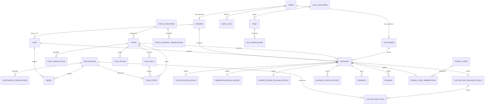

# Armenia Tourism Platform Architecture

## Scope and architectural decisions

The MVP is a mobile-first private-travel marketplace. A customer selects a service, date and vehicle, supplies pickup and contact details, receives a server-calculated price, and creates a booking that operations staff can assign and complete.

Key decisions:

- Backend and frontend remain separate deployable repositories.
- The REST API is versioned under `/api/v1` and uses Sanctum tokens, making the same API usable by the React SPA and future mobile clients.
- `bookings` is the canonical operational record. Service-specific data lives in one-to-one detail tables so transfers and custom trips do not add dozens of nullable columns to every booking.
- Prices are stored as signed 64-bit integer minor units with ISO currency codes. No floating point is used for money.
- Snapshot fields preserve the booked route, price breakdown, customer details and product labels even after catalog content changes.
- Localized catalog content uses translation tables keyed by `(entity_id, locale)`.
- Roles are a small application enum for the MVP. Policies enforce resource actions; route middleware only provides broad area protection.
- Routing, pricing, currency conversion, payment and outbound notification providers are contracts with replaceable adapters.
- Availability is checked again inside the booking transaction. Database indexes plus transactional locking protect against concurrent assignments.

## Backend folder structure

```text
app/
  Actions/Booking/            # transactional use cases
  Contracts/                  # routing, payment, FX, notification contracts
  Data/                       # immutable service input/output DTOs
  Enums/                      # persisted domain values
  Events/                     # BookingCreated, DriverAssigned, status events
  Http/
    Controllers/Api/V1/       # thin public/customer/admin/driver controllers
    Middleware/
    Requests/                 # authorization + input validation
    Resources/                # stable response representations
  Jobs/                       # queued integration work
  Listeners/                  # event side effects
  Models/                     # Eloquent persistence models
  Notifications/              # channel-neutral notification content
  Policies/                   # model-level authorization
  Providers/                  # contract bindings
  Services/
    Availability/
    Booking/
    Money/
    Notifications/
    Pricing/
    Routing/
database/
  factories/
  migrations/
  seeders/
docs/
routes/
  api.php                     # includes versioned route files as API grows
tests/
  Feature/Api/V1/
  Unit/Services/
```

Repositories are introduced only where a use case needs a query abstraction beyond focused Eloquent scopes/query objects.

## Frontend folder structure

```text
src/
  app/                        # router, providers, query client, global styles
  assets/
  components/
    ui/                       # buttons, inputs, dialogs, badges
    layout/                   # public/admin shells
  features/
    auth/
    booking/
    cars/
    custom-trip/
    destinations/
    tours/
    transfers/
    private-driver/
    admin/
  hooks/
  i18n/                       # UI message catalogs (en, ru, hy)
  lib/                        # Axios client, money/date helpers
  pages/                      # route composition only
  routes/
  types/                      # shared API-facing TypeScript types
```

Each feature owns its API functions, query keys, schemas, components and tests. Database content arrives already localized using `locale` or `Accept-Language`; interface chrome uses frontend message catalogs.

## Entity relationship design



### Catalog and content

- `destinations`: slug, coordinates, address, cover media, active/featured flags, sort order.
- `destination_translations`: destination, locale, name, descriptions, SEO title/description; unique destination + locale.
- `tour_categories` and `tour_category_translations`: localized category catalog and SEO.
- `tours`: category, slug, duration, distance, starting amount/currency, pricing type, capacity and booking/cancellation flags.
- `tour_translations`: localized title, descriptions and SEO.
- `tour_days`: ordered day number and optional default start/overnight metadata.
- `tour_stops`: ordered stops with `tour_id` and optional `tour_day_id`. One-day tours satisfy the requested direct itinerary model; multi-day tours group those same stops by day without duplicating route concepts.
- `tour_prices`: optional authoritative price matrix by tour, car category, season/date range and passenger bounds.
- `media`: polymorphic files with disk, path, mime type, collection, alt text and sort order; storage disk can move from public to S3.

### Fleet and people

- `users`: authentication identity, role, locale and active state.
- `customers`: optional linked user plus normalized contact/profile data; guest details are also snapshotted on bookings.
- `cars`: fleet identity, enum-backed category, capacities, features, availability and monetary rate fields.
- `drivers`: linked user, license, languages JSON, experience, rating and preferred car.
- `driver_cars`: many-to-many authorized vehicle assignments.

### Booking aggregate

- `bookings`: UUID, hashed public access token, unique booking number, idempotency key, service type, selected/assigned entities, booking date/pickup time and planned end, pickup/drop-off coordinates and addresses, passengers, customer snapshot, amount breakdown, currency, payment status and booking status.
- `tour_booking_details`: selected tour snapshot and requested options.
- `transfer_booking_details`: airport, flight, arrival, pickup sign, child seat and waiting details.
- `private_driver_booking_details`: package/duration and requested destination snapshot.
- `custom_trip_booking_details`: route summary, return preference and calculated distance/durations.
- `custom_trip_stops`: ordered route points with optional destination link and coordinate/address snapshot.
- `booking_status_history`: actor, old/new status, note and timestamp.
- `payments`: provider-neutral payment attempts, provider references, amount/currency, status and payload metadata.
- `reviews`: booking-linked review; verified is granted only for a completed booking.

### Operations and CMS

- `promo_codes`, `promo_code_redemptions`: constraints and immutable redemption amounts.
- `settings`: typed key/value records, optionally localized or grouped.
- `faq_categories`, `faqs`, `faq_translations`: ordered localized FAQ content.
- `contact_inquiries`: contact submissions and processing state.
- `audit_logs`: actor, action, polymorphic subject, old/new JSON, IP and user agent.
- `notifications`: Laravel database notifications; external channels are queued listeners.

## Migration plan

Migrations are intentionally grouped by dependency order:

1. Laravel users, cache, jobs and Sanctum token tables.
2. Add platform identity/role fields to users.
3. Create customers, cars, drivers and driver-cars.
4. Create media.
5. Create destinations and destination translations.
6. Create tour categories/translations, tours/translations, tour days, tour stops and tour prices.
7. Create promo codes.
8. Create bookings and four service-detail tables.
9. Create custom-trip stops and booking status history.
10. Create payments and promo-code redemptions.
11. Create reviews.
12. Create FAQ/CMS settings and contact inquiries.
13. Create audit logs and notification storage.

Every foreign key is explicit. Operational lookup indexes cover service window/date, statuses, customer, tour, car and driver. Public identifiers and idempotency keys are unique. Catalog models use soft deletes; transaction/history rows do not.

## Laravel model list

`User`, `Customer`, `Destination`, `DestinationTranslation`, `TourCategory`, `TourCategoryTranslation`, `Tour`, `TourTranslation`, `TourDay`, `TourStop`, `TourPrice`, `Car`, `Driver`, `Media`, `Booking`, `TourBookingDetail`, `TransferBookingDetail`, `PrivateDriverBookingDetail`, `CustomTripBookingDetail`, `CustomTripStop`, `BookingStatusHistory`, `Payment`, `PromoCode`, `PromoCodeRedemption`, `Review`, `FaqCategory`, `Faq`, `FaqTranslation`, `Setting`, `ContactInquiry`, and `AuditLog`.

## PHP enum list

Foundation enums now present: `UserRole`, `BookingStatus`, `PaymentStatus`, `ServiceType`, `PricingType`, `CarCategory`, `CurrencyCode`, `PromoCodeType`, and `DriverTripStatus`.

Planned when their modules land: `PaymentMethod`, `PaymentTransactionStatus`, `TransmissionType`, `MediaCollection`, `ContactInquiryStatus`, and `SettingValueType`.

## Public API design

All endpoints are under `/api/v1`. Collection endpoints support `page`, `per_page`, documented filters and stable sorting. Localized resources use `Accept-Language` with `?locale=` as an explicit override.

```text
GET    /health
POST   /auth/login
GET    /auth/me                         authenticated
POST   /auth/logout                     authenticated

GET    /tours
GET    /tours/{slug}
GET    /tour-categories
GET    /tour-categories/{slug}/tours
GET    /destinations
GET    /destinations/{slug}
GET    /cars
GET    /cars/{car}
GET    /faqs
GET    /settings/public
GET    /reviews

POST   /pricing/tours/estimate
POST   /custom-trips/estimate
POST   /transfers/estimate
POST   /private-driver/estimate
POST   /bookings                        idempotency-key required
GET    /bookings/{bookingNumber}/{token}
POST   /bookings/{bookingNumber}/{token}/cancel
POST   /bookings/{bookingNumber}/{token}/reviews
POST   /contact-inquiries

GET    /customer/bookings               authenticated customer
GET    /customer/bookings/{booking}
POST   /customer/bookings/{booking}/cancel
GET    /customer/bookings/{booking}/confirmation
```

The booking request sends selections and contact data, never an accepted final price. The response includes the authoritative calculation and secure public URL.

## Admin and driver API design

```text
GET    /admin/dashboard
GET    /admin/dashboard/statistics
GET    /admin/bookings/calendar
apiResource /admin/bookings
POST   /admin/bookings/{booking}/confirm
POST   /admin/bookings/{booking}/assign
POST   /admin/bookings/{booking}/status
POST   /admin/bookings/{booking}/cancel
apiResource /admin/tours
apiResource /admin/tour-categories
apiResource /admin/destinations
apiResource /admin/cars
apiResource /admin/drivers
apiResource /admin/customers             index/show/update
apiResource /admin/reviews               index/show/update/destroy
apiResource /admin/promo-codes
apiResource /admin/faqs
GET|PUT /admin/settings
GET|PUT /admin/contact-inquiries
POST   /admin/media
DELETE /admin/media/{media}
GET    /admin/audit-logs

GET    /driver/trips
GET    /driver/trips/{booking}
POST   /driver/trips/{booking}/status
```

`admin` can access all admin endpoints. `manager` receives policy-scoped booking, customer, tour, car and driver access only. Driver routes require both the driver role and ownership of the assigned booking.

## React routes

```text
/
/tours
/tours/:slug
/tours/category/:slug
/destinations
/destinations/:slug
/cars
/airport-transfer
/private-driver
/build-your-trip
/booking
/booking/confirmation/:bookingNumber
/booking/:bookingNumber/:secureToken
/about
/contact
/faq
/login
/account/bookings
/account/bookings/:id
/account/profile

/admin
/admin/bookings
/admin/bookings/:id
/admin/calendar
/admin/tours
/admin/tours/create
/admin/tours/:id/edit
/admin/destinations
/admin/cars
/admin/drivers
/admin/customers
/admin/reviews
/admin/promo-codes
/admin/settings

/driver/trips
/driver/trips/:id
```

Public, customer, admin and driver route shells are lazy-loaded separately. Booking uses a single route with an internal step state machine and a sticky mobile price/CTA.

## MVP development roadmap

1. **Foundation:** Laravel 12/PHP 8.4 contract, Sanctum, roles, API conventions, base tests and architecture.
2. **Catalog schema:** destinations, categories, tours/multi-day itineraries, fleet, drivers, translations, media and realistic seeders.
3. **Core engines:** money value objects, price breakdowns, promotions, routing adapter and overlap-safe availability.
4. **Booking transaction:** idempotent guest/customer booking action, detail snapshots, secure lookup, status history, events and queued notifications.
5. **Operations API:** admin policies, CRUD, assignment workflow, dashboard and calendar queries; driver trip endpoints.
6. **Public API:** localized catalogs, estimators, contact/FAQ/settings, reviews, rate limiting and OpenAPI documentation.
7. **React foundation:** strict TypeScript, Vite, Tailwind, router, Axios, TanStack Query, i18n and design tokens.
8. **Customer experience:** premium public pages, catalog details, itinerary, custom builder and mobile step booking.
9. **Admin MVP:** login, dashboard, booking/calendar workflow and catalog/fleet management.
10. **Hardening and delivery:** feature/unit tests, accessibility/SEO, Docker services, queue worker, deployment guide and CI.

Each phase must pass formatting, static checks where configured, migrations and automated tests before the next phase begins.

## Implementation status

- Phase 1 complete: Laravel/Sanctum foundation, roles, domain enums and versioned authentication API.
- Phase 2 complete: destination, translation, fleet, driver, media, tour, multi-day itinerary and tour-price persistence with multilingual Armenia seed data.
- Phase 3 complete: canonical booking calendar, customer and promo persistence; authoritative pricing; promotion validation; replaceable route calculation; and overlap-aware fleet/driver availability.
- Phase 4 complete: transactional and concurrency-safe booking creation, service-specific snapshots, yearly booking sequences, idempotency claims, secure public lookup, status history/transitions, after-commit events, and queued email notifications.
- Next: admin/public catalog APIs, policies, fleet assignment workflow, filters, resources and pagination.

Percentage promo values are persisted in basis points (`1000` means `10.00%`); fixed values and all thresholds/caps use currency minor units. The MVP route adapter estimates road distance from straight-line segments using a configurable factor. It is deliberately exposed through `RouteCalculationService`, so a routing provider can replace it without changing pricing or booking workflows.

Public booking tokens are deterministic HMAC values derived from the booking UUID and application key. Only a SHA-256 token hash is persisted. This allows an identical idempotent retry to receive the same secure URL without storing a recoverable plaintext token. `booking_idempotency_keys` serializes concurrent requests for the same key and rejects reuse with a different request fingerprint.
